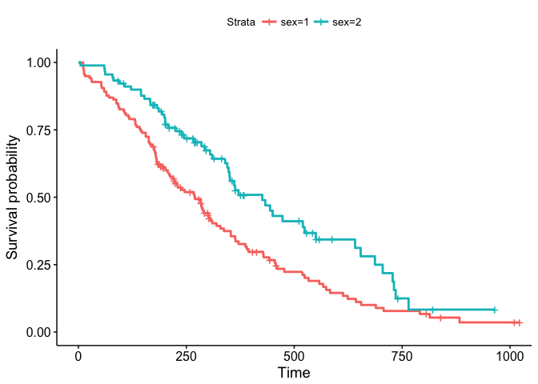
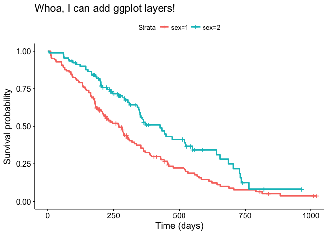
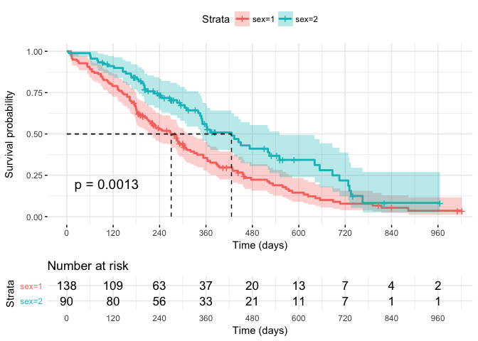
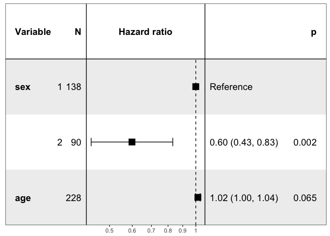

Survival Methods in R
================

Easily obtain common results and outputs. This should get you 80% of the way.

Contents

-   KM Curves
-   Cox model
-   Forest Plots
-   Tips, notes, documentation links

``` r
library(dplyr)
library(broom)                          # tidy()
library(survival)                       # for survival methods
```

Data
====

`lung` is a dataset in `survival` package.

**Let's make sure our factors are not treated as continuous.**

``` r
df <- lung %>%
    as_tibble %>%
    mutate(sex=as.character(sex))       # or factor(sex)
```

KM Curves
=========

Awesome Kaplan Meier curves, with risk tables

``` r
library(survminer)
```

``` r
mod <- survfit(Surv(time, status) ~ sex, data = df)

ggsurvplot(mod, data = df)
```



### Details

Add `+` layers like with standard ggplot. Awesomeness!

``` r
ggsurvplot(mod, data=df) +
    ggtitle("Whoa, I can add ggplot layers!") +
    labs(x="Time (days)")
```



Here are more options (documentation at bottom)

``` r
ggsurvplot(mod, data=df, risk.table=TRUE, pval=TRUE,
           conf.int=TRUE, surv.median.line="hv",
           break.time.by=120, ggtheme=theme_minimal()) +
    labs(x="Time (days)")
```



Cox model
=========

Basic cox model and results

``` r
mod <- coxph(Surv(time, status) ~ sex + age, data = df)

summary(mod)
```

    ## Call:
    ## coxph(formula = Surv(time, status) ~ sex + age, data = df)
    ## 
    ##   n= 228, number of events= 165 
    ## 
    ##           coef exp(coef)  se(coef)      z Pr(>|z|)   
    ## sex2 -0.513219  0.598566  0.167458 -3.065  0.00218 **
    ## age   0.017045  1.017191  0.009223  1.848  0.06459 . 
    ## ---
    ## Signif. codes:  0 '***' 0.001 '**' 0.01 '*' 0.05 '.' 0.1 ' ' 1
    ## 
    ##      exp(coef) exp(-coef) lower .95 upper .95
    ## sex2    0.5986     1.6707    0.4311    0.8311
    ## age     1.0172     0.9831    0.9990    1.0357
    ## 
    ## Concordance= 0.603  (se = 0.026 )
    ## Rsquare= 0.06   (max possible= 0.999 )
    ## Likelihood ratio test= 14.12  on 2 df,   p=0.0008574
    ## Wald test            = 13.47  on 2 df,   p=0.001187
    ## Score (logrank) test = 13.72  on 2 df,   p=0.001048

### Details

Let's put the above into a nice data frame.

(the `broom` package is highly recommended to tidy model results)

``` r
mod %>% tidy
```

    ##   term    estimate   std.error statistic     p.value     conf.low
    ## 1 sex2 -0.51321852 0.167457962 -3.064760 0.002178445 -0.841430092
    ## 2  age  0.01704533 0.009223273  1.848078 0.064591012 -0.001031952
    ##     conf.high
    ## 1 -0.18500694
    ## 2  0.03512262

Exponentiate to get HR and 2.5, 97.5% CI's, plus select what you need

``` r
mod %>%
    tidy %>%
    mutate(
        estimate=exp(estimate),
        conf.low=exp(conf.low),
        conf.high=exp(conf.high)
    ) %>%
    select(term, estimate, starts_with("conf"))
```

    ##   term estimate  conf.low conf.high
    ## 1 sex2 0.598566 0.4310936 0.8310985
    ## 2  age 1.017191 0.9989686 1.0357467

Base R: Extract useful stuff from Cox model

``` r
confint(mod)
```

    ##             2.5 %      97.5 %
    ## sex2 -0.841430092 -0.18500694
    ## age  -0.001031952  0.03512262

``` r
exp(confint(mod))
```

    ##          2.5 %    97.5 %
    ## sex2 0.4310936 0.8310985
    ## age  0.9989686 1.0357467

``` r
survfit(mod)
```

    ## Call: survfit(formula = mod)
    ## 
    ##       n  events  median 0.95LCL 0.95UCL 
    ##     228     165     320     285     363

Easy Forest plot
================

**Reminder**: factors cannot be numeric, otherwise `forestmodel` doesn't work properly! The package doesn't like `factor()` in `coxph`, so use `as.character` (see top).

Personally, I suggest cross-checking the output (treat it as a beta app).

``` r
## install.packages("forestmodel")
library(forestmodel)

mod <- coxph(Surv(time, status) ~ sex + age, data = df)

forest_model(mod)
```



Tips
====

Recommended documentation:

-   [KM plots awesomeness with `survminer`](https://cran.r-project.org/web/packages/survminer/vignettes/Informative_Survival_Plots.html)
-   Forest Plots with `forestmodel`: [Github](https://github.com/NikNakk/forestmodel) | [StackOverflow](https://stackoverflow.com/a/31373382/3217870)
-   [`broom` is awesome](http://varianceexplained.org/r/broom-intro/)

Cool mutates with `mutate_at`

``` r
mod %>%
    tidy %>%
    mutate_at(vars(estimate, starts_with("conf")), exp) %>%
    select(term, estimate, conf.low, conf.high)
```

    ##   term estimate  conf.low conf.high
    ## 1 sex2 0.598566 0.4310936 0.8310985
    ## 2  age 1.017191 0.9989686 1.0357467
